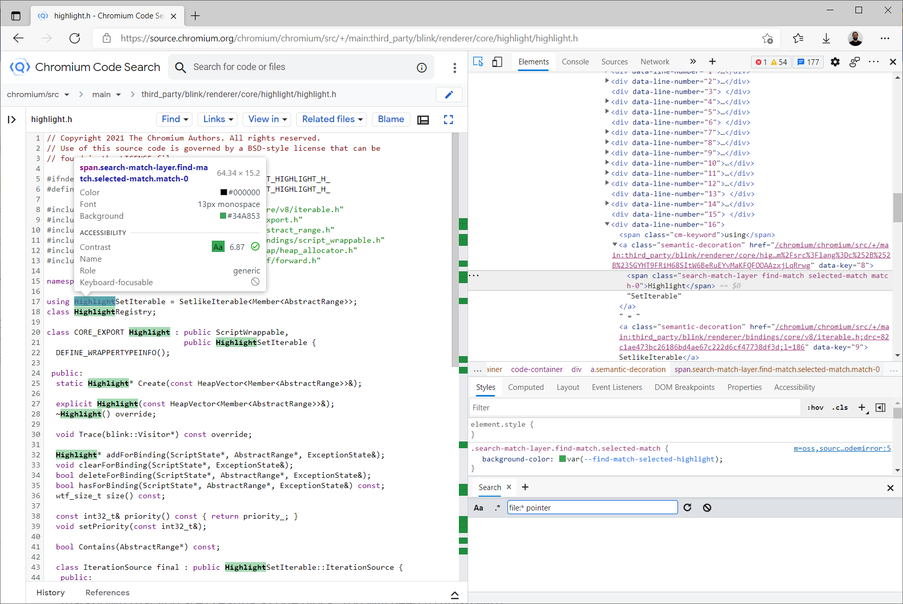

# Highlight API 

The [Custom Highlight API](https://drafts.csswg.org/css-highlight-api-1/) extends the concept of [highlight pseudo-elements](https://drafts.csswg.org/css-pseudo-4/#highlight-pseudo-element) by providing a way for web developers to style the text of arbitrary range objects ([Ranges](https://dom.spec.whatwg.org/#interface-range) or [StaticRanges](https://dom.spec.whatwg.org/#interface-staticrange)), rather than being limited to the user agent defined `::selection`, `::inactive-selection`, `::spelling-error`, and `::grammar-error`. It provides a programmatic way of adding and removing highlights that do not affect the underlying DOM structure, but instead applies styles to text based on range objects, accessed via the `::highlight()` pseudo element. This is useful in a variety of scenarios, including editing frameworks that wish to implement their own selection, find-on-page over virtualized documents, multiple selection to represent online collaboration, or spellchecking frameworks.

This document intends to give a brief introduction to the Highlight API and how to use it, as well as compare performance and ease-of-use with a traditional way of highlighting text.

## Browser support

In order to be able to use the Highlight API or run the demos, Edge or Chrome >= 93 is needed (although it's recommended to use >= 95 for testing including the latest patches). The browser should be run with the flag `--enable-experimental-web-platform-features`, which can be turned on in `edge://flags` or `chrome://flags` under the name of 'Experimental Web Platform features'. There's also an experimental implementation in WebKit that supports it and can be enabled in Safari by going to Develop - Experimental Features - Highlight API (note that it might not work exactly as expected there due to recent changes in the [specification](https://drafts.csswg.org/css-highlight-api-1/)).

## How to use it

Custom highlights are represented by [Highlight](https://drafts.csswg.org/css-highlight-api-1/#creation) objects. A Highlight contains ranges that can be added either by passing them to its constructor or by setting them to the object after creation.

In order to have any effect, custom highlights need to be registered into the highlight registry, represented by a [HighlightRegistry](https://drafts.csswg.org/css-highlight-api-1/#registration) object. The highlight registry is accessed via the `highlights` attribute of the CSS namespace, and represents all the custom highlights registered for the current global object’s associated Document. It is a map that relates custom highlight names to Highlight objects. The names are represented by Strings, and they are used to link a custom highlight to its [corresponding style](https://drafts.csswg.org/css-highlight-api-1/#styling-highlights) defined in the style section. For example:

```Javascript
<style>
  ::highlight(foo) {
      color: blue;
  }
</style>
<script>
  let range1 = new Range();
  let range2 = new StaticRange({startContainer: document.body, startOffset: 0, endContainer: document.body, endOffset: 1});
  let customHighlight = new Highlight(range1);
  customHighlight.add(range2);
  CSS.highlights.set('foo', customHighlight);
</script>
```

In the case above, a custom highlight is registered under the name 'foo', so all ranges contained in it will be styled with text color blue, as specified in the style section.

Finally, the next example shows a simple way of applying styles to the currently selected text with the Highlight API:

```Javascript
<style>
  ::highlight(example-highlight) {
    color: blue;
  }
</style>

<script>
  function highlightSelectionWithAPI() {
    let range = window.getSelection().getRangeAt(0).cloneRange();
    if(CSS.highlights.has("example-highlight")) 
      CSS.highlights.get("example-highlight").add(range);
    else
      CSS.highlights.set("example-highlight", new Highlight(range));
  }
  
  function clearAPIHighlight() {
    CSS.highlights.delete("example-highlight");
  }
</script>
```

## How to highlight text *without* the Highlight API

Traditionally, a common way to highlight different pieces of text dynamically in a webpage is to just wrap the content with a new `<span>` with a particular class or id that is given a specific style. An example of this technique can be found in [chromium code search](https://source.chromium.org)'s custom find-on-page, where if you look for text inside a source code file, the site highlights all matching strings with new spans. An actual screenshot is shown next:




However, implementing this can be somewhat cumbersome because we need to manipulate the DOM tree by inserting new objects into it. This can lead to many issues:

- We should be careful not to break other processing of the DOM or cached elements, as the number of children/siblings of a node could change. This means the rest of the webpage should support dynamic changes in the DOM and act accordingly.

- Some cases are not easy to handle. For example, highlighting a chunk of text that crosses a node boundary. Another complicated case arises if we have many different highlighting styles and need to apply them to overlapping pieces of text.

- Performance could be impacted due to the cost of allocating the `<span>`s and adding them to the DOM, including the cost of rerunning layout. This could affect operations such as rendering frames or performing other actions needed by the site itself. See [Demo 2](https://github.com/ffiori/highlight-api-demos/tree/add-readme#demo-2-performance-of-both-approaches) for a performance comparison with the Highlight API.

- Reverting the operation is not easy in non-trivial sites. We should traverse the DOM looking for spans with specific ids or classes and delete them while reinserting their content into the same place it was before. Furthermore, this operation could be computationally expensive if the DOM's got too big and there are many highlighted spans to remove.

Here is a possible way of implementing this technique to highlight selected text that would only work for simple sites:

```Javascript
<style>
  .highlighted-with-span {
    color: red;
  }
</style>

<script>
  function highlightSelectionWithSpans() {
    if (window.getSelection().isCollapsed)
      return;
    try {
      let span = document.createElement('span');
      span.className = "highlighted-with-span";
      window.getSelection().getRangeAt(0).surroundContents(span);
    }
    catch (error) {
      ; // Treat error
    }
  }

  function clearSpans() {
    let spans = document.getElementsByClassName("highlighted-with-span");
    while(spans.length) {
      let span = spans[0];
      span.parentNode.insertBefore(span.firstChild, span);
      span.parentNode.removeChild(span);
    }
  }
<script>
```

## Examples

### [Demo 1: Compare highlighting with and without using the API](https://ffiori.github.io/highlight-api-demos/demo-compare-highlighting.html)

This demo is a page that allows the user to highlight selected text with the Highlight API or wrapping with spans. The source code can be found [here](https://github.com/ffiori/highlight-api-demos/blob/main/demo-compare-highlighting.html) and is meant to show a simple implementation of the same functionality using each of the methods. It is a complete functional web site that uses implementations similar to those described in the previous sections as examples.

### [Demo 2: Performance of both approaches](https://ffiori.github.io/highlight-api-demos/demo-performance.html)

This demo shows the performance differences of using the Highlight API or wrapping with spans to highlight text (source code [here](https://github.com/ffiori/highlight-api-demos/blob/main/demo-performance.html)). The text is composed by many spans (10,000 by default but this number can be changed while running the site) which are highlighted independently. This tries to simulate a situation where a large page is loaded and a find on page instruction is executed with a common string (for example "a"), so we need to highlight a large number of pieces of text. The user can test the different methods of highlighting, and also the time it takes for each approach to clear the highlights.

Some average times for the operations are shown next. Each operation was run 5 times (always from a fresh start) on an Intel i7-9700K CPU with 30,000 independent words, and the average times were the following:

```
Highlight with API using Ranges: 223ms
Highlight with API using StaticRanges: 234ms
Clear API Highlights: 67ms

Highlight with spans: 708ms
Clear highlighted spans: 16675ms
```
